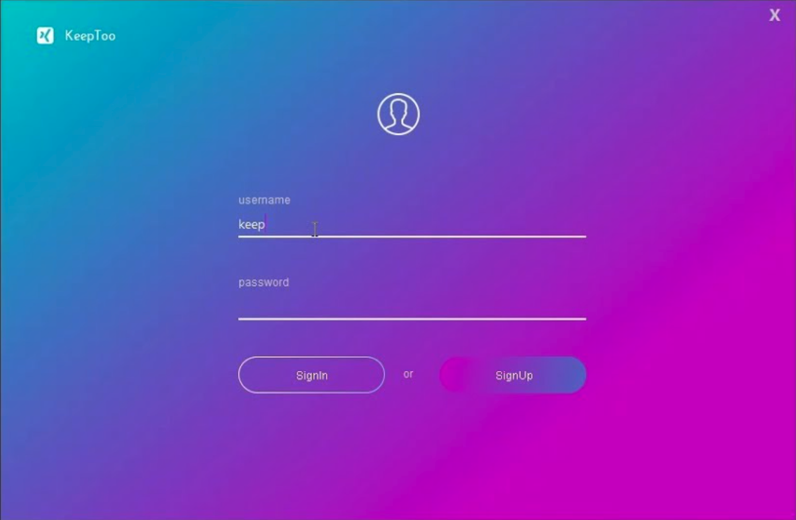

# Java Swing


---

## What's Java Swing?

- Swing is a GUI (Graphical User Interface) library for Java.
- Part of the Java Foundation Classes (JFC).
- Provides a set of lightweight components for creating desktop applications.
- Swing is platform-independent and looks the same on different OS (multiplatform)
- This is automatically installed in your JDK (Version 8 and above)
---

## Swing Components

- **JFrame**: The main application window.
- **JPanel**: A container for organizing components.
- **JButton**: A clickable button.
- **JLabel**: A non-editable text component.
- **JTextField**: A single-line text input.
- **JTextArea**: A multi-line text input.
- **JComboBox**: A dropdown menu.
- And many more...

---

## Swing's Look and Feel

- Swing supports different look and feel options.
- The default is the Metal look and feel.
- You can choose a look and feel that matches the OS.
- Popular options: **Nimbus**, **Windows**, **GTK**.

---
## For instance...

 


___
## Versus...

 


___

## Creating a Swing App

```java
import javax.swing.*;

public class MySwingApp {
    public static void main(String[] args) {
        JFrame frame = new JFrame("Hello Swing!");
        frame.setDefaultCloseOperation(JFrame.EXIT_ON_CLOSE);
        frame.setSize(400, 300);
        frame.setVisible(true);
    }
}

```

___

## More than Animations

**Event Handling**
- Essentially recognizing a user action (button click, text input, etc)

```java
button.addActionListener(new ActionListener() {
    public void actionPerformed(ActionEvent e) {
        // Do something when the button is clicked
    }
});
```

___

## Customization
- Adding attributes like font, colors, background colors, etc
- Quite similar to CSS (Cascading Style Sheet) but a functional approach and less customization

```java
JButton button = new JButton("Click Me");
//setting the button size
button.setPreferredSize(new Dimension(100, 50));

//adding an image to the button
Icon icon = new ImageIcon("icon.png");
button.setIcon(icon);
```
___

## Places to Learn More

Official Java Docs: https://docs.oracle.com/javase/tutorial/uiswing/

Youtube Series: https://www.youtube.com/watch?v=Kmgo00avvEw&feature=youtu.be

